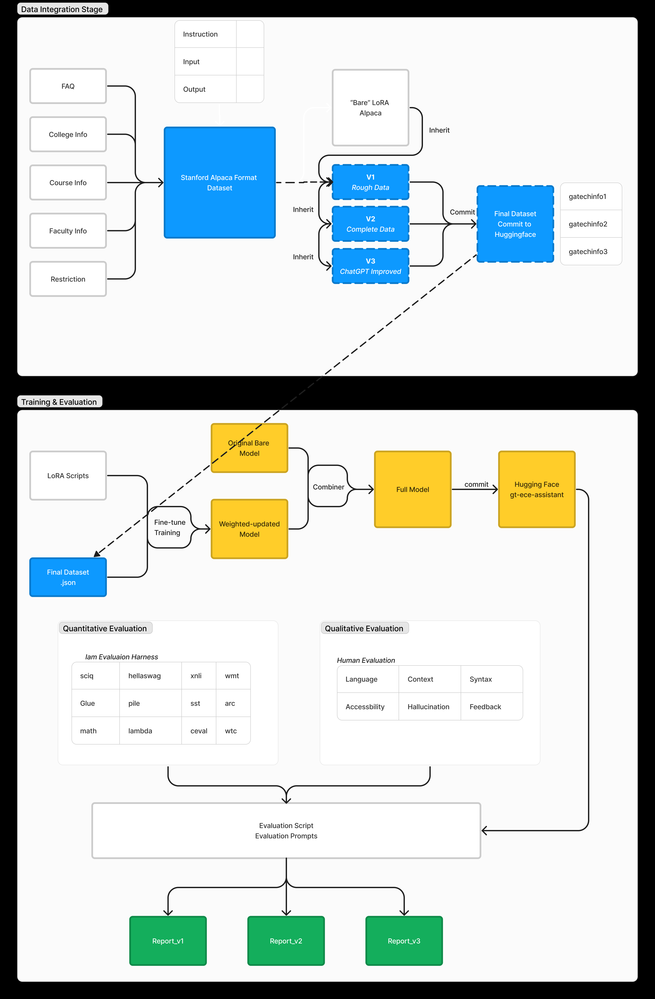
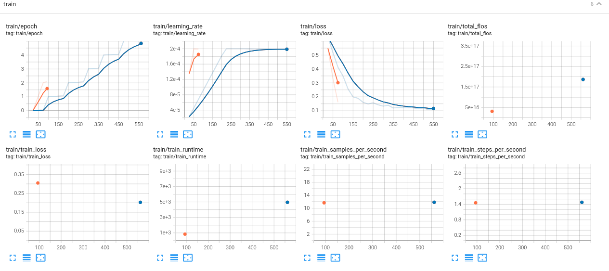
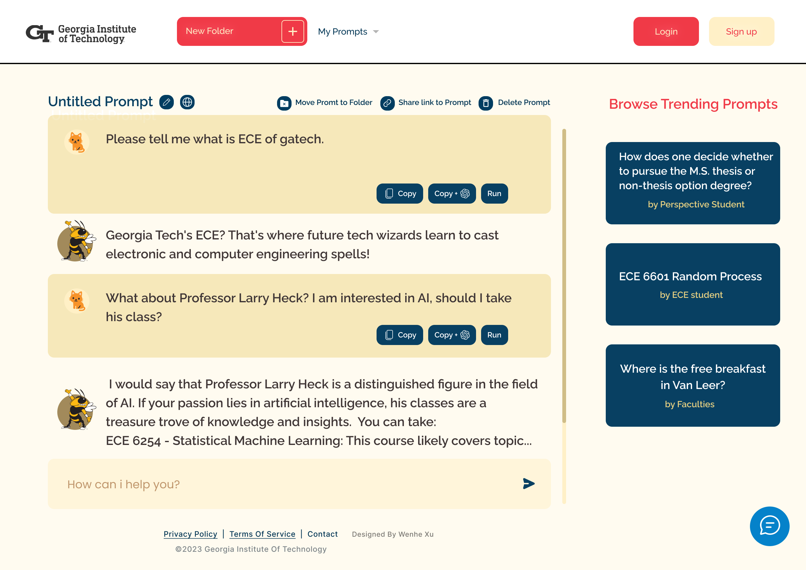
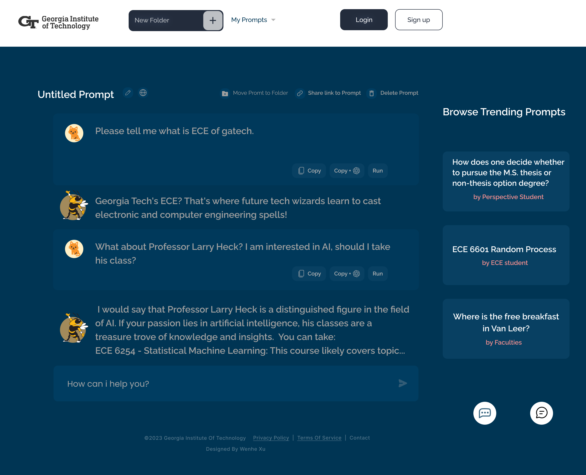

# Code README

The link to the code: https://github.gatech.edu/wxu372/ece-assistant-8803



# Environment

```bash
git clone https://github.gatech.edu/wxu372/ece-assistant-8803
cd ece-assistant-8803
pip install -r requirements.txt

# establish the conda environment
. start_linux.sh
```

# Dataset Extractor

Please see the 

```python
prompt.ipynb
```

## ChatGPT Refiner

Please replace 'your_api_key' with your actual OpenAI API key by modifying the code of [improver.py](http://improver.py) 

Then simply 

```python
python improver.py
```

# Trainer

Please adjust the path configuration of trainers in your need.

All the training and testing scripts are in the ./train_test folder

You can view a step-by-step pipeline in the

```python
Llama-2-finetune-qlora.ipynb
```

## Params of usage

Please add the specific param in your need when run the trainer code

```python
	#Parse the arguments
    parser = argparse.ArgumentParser()
    # Model-name should be the base model of hf
    parser.add_argument("--model-name", type=str, required=True)
    parser.add_argument("--dataset", type=str, default="RansErica/gatechinfo1") # the dataset, you can use hugging face path as shown here
    parser.add_argument("--split", type=str, default="train[:10%]")
    parser.add_argument("--hf_repo", type=str, required=True) # the hugging face repo of your output repo
    parser.add_argument("--lr", type=float, default=2e-4)
    parser.add_argument("--epochs", type=int, default=3)
    parser.add_argument("--trained-model-name", type=str, required=True) # the local folder name to save your model
    parser.add_argument('--bf16', action='store_true')
```

For version 1 (using train_1.py)

```python
python train_1.py --model-name NousResearch/Llama-2-7b-chat-hf --hf_repo RansErica/gt-ece-assistant-v1 --trained-model-name gatech-ece-assistant-v1 --split train --epochs 3 --bf16
```

For version 2, as example:

```python
python train.py --model-name NousResearch/Llama-2-7b-chat-hf --hf_repo RansErica/gt-ece-assistant-v2 --trained-model-name gatech-ece-assistant --split train --epochs 6 --bf16 --dataset RansErica/gatechinfo3
```

## Review the Dashboard of Training(Tensorboard)

Jump to the directory of your local output model,

Run this in your terminal:

```python
%load_ext tensorboard
%tensorboard --logdir results/runs
```

You will probably see the [localhost](http://localhost) link provided by tensorboard




# Quantitative Evaluator

For the evaluator, we use Im-evaluation-harness toolkits to have the quantitative evaluation on different dataset.

[https://github.com/EleutherAI/lm-evaluation-harness](https://github.com/EleutherAI/lm-evaluation-harness)

To install the evaluator, you need to 

```python
git clone https://github.com/EleutherAI/lm-evaluation-harness
cd lm-evaluation-harness
pip install -e .
pip install -e ".[multilingual]"
```

## Basic Usage

To evaluate a model hosted on the [HuggingFace Hub](https://huggingface.co/models) (e.g. our v3-model on hf) on `hellaswag` you can use the following command:

```
python main.py \
    --model hf-causal \
    --model_args pretrained=RansErica/gt-ece-assistant-v3 \
    --tasks hellaswag \
    --device cuda:0
```

Additional arguments can be provided to the model constructor using the `--model_args` flag. Most notably, this supports the common practice of using the `revisions` feature on the Hub to store partially trained checkpoints, or to specify the datatype for running a model:

```
python main.py \
    --model hf-causal \
    --model_args pretrained=RansErica/gt-ece-assistant-v3,revision=step100000,dtype="float" \
    --tasks lambada_openai,hellaswag \
    --device cuda:0
```

To evaluate models that are loaded via `AutoSeq2SeqLM` in Huggingface, you instead use `hf-seq2seq`. *To evaluate (causal) models across multiple GPUs, use `--model hf-causal-experimental`*

## Advanced Usage

For models loaded with the HuggingFace `transformers` library, any arguments provided via `--model_args` get passed to the relevant constructor directly. This means that anything you can do with `AutoModel` can be done with our library. For example, you can pass a local path via `pretrained=` or use models finetuned with [PEFT](https://github.com/huggingface/peft) by taking the call you would run to evaluate the base model and add `peft=PATH` to the `model_args` argument:

```python
python main.py \
    --model hf-causal-experimental \
    --model_args pretrained=EleutherAI/gpt-j-6b,peft=nomic-ai/gpt4all-j-lora \
    --tasks openbookqa,arc_easy,winogrande,hellaswag,arc_challenge,piqa,boolq \
    --device cuda:0
```

# Qualitative Evaluator

You should modify the [test.py](http://test.py) file in your need, especially the entry of:

```python
model_id = "/home/hice1/wxu372/scratch/workspace/merged_model_1"
```

And the saved file name

```python
filename = f"generated_course_instructions_v1_{current_time}.csv"
```

After running by 

```python
python test.py
```

You will see a csv output and printed result in terminal

# User Interface

### Light UI



### Dark UI


# Cite as

@misc{gt-ece-chatbot-advisor,
author       = {Xu, Wenhe and
Xiong, Enyuan and
Carbillet, Baptiste},
title        = {A Georgia Tech ECE Advisory Assistant Based on LLaMA-2: A LoRA Fine-Tuning Approach},
month        = dec,
year         = 2023,
version      = {v0.0.5},
url          = {[https://github.gatech.edu/wxu372/ece-assistant-8803](https://github.gatech.edu/wxu372/ece-assistant-8803)}
}

# Reference code

[GitHub - declare-lab/instruct-eval: This repository contains code to quantitatively evaluate instruction-tuned models such as Alpaca and Flan-T5 on held-out tasks.](https://github.com/declare-lab/instruct-eval/tree/main)

[GitHub - edumunozsala/llama-2-7B-4bit-python-coder: Fine-tune Llama-2 7B to generate Python code](https://github.com/edumunozsala/llama-2-7B-4bit-python-coder/tree/main)

[https://github.com/facebookresearch/llama](https://github.com/facebookresearch/llama)

[ML Blog - Fine-Tune Your Own Llama 2 Model in a Colab Notebook](https://mlabonne.github.io/blog/posts/Fine_Tune_Your_Own_Llama_2_Model_in_a_Colab_Notebook.html)

[GitHub - EleutherAI/lm-evaluation-harness at big-refactor](https://github.com/EleutherAI/lm-evaluation-harness/tree/big-refactor)